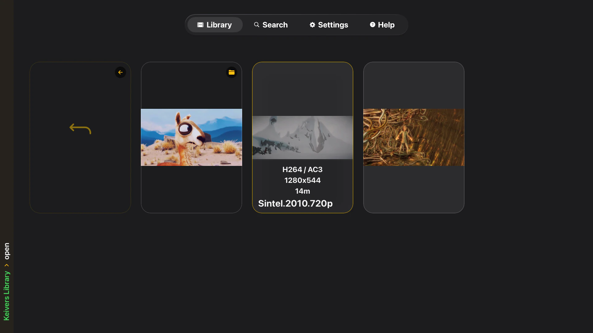
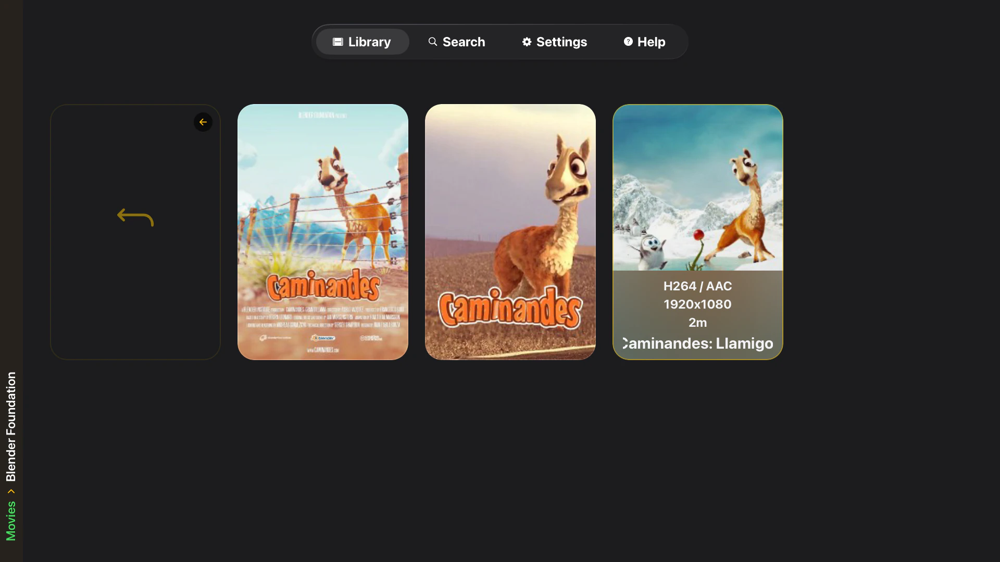
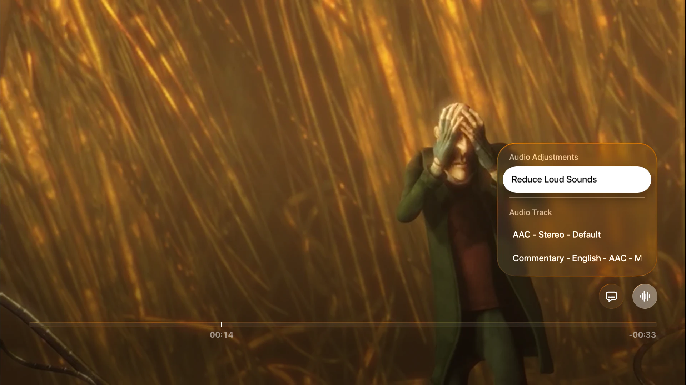
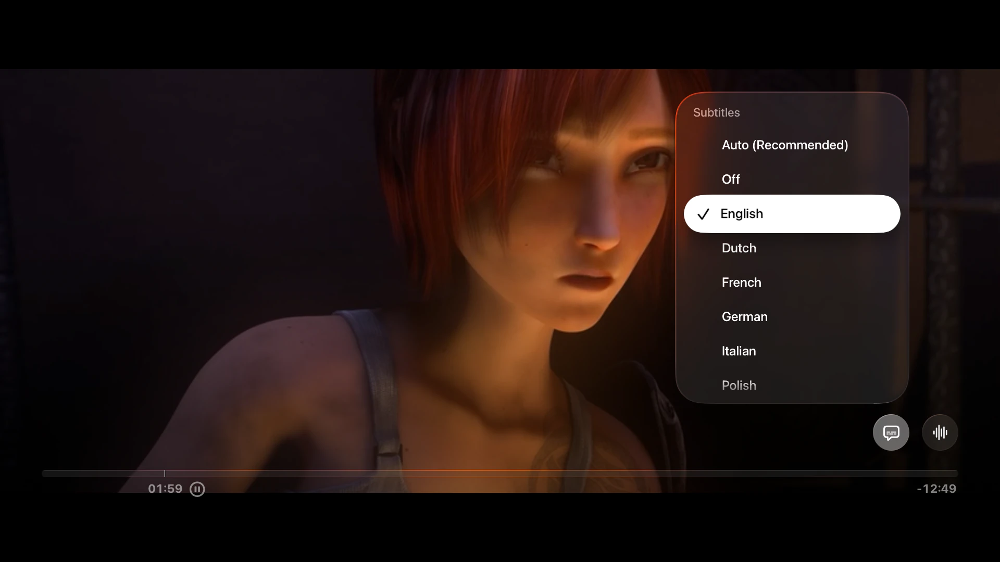
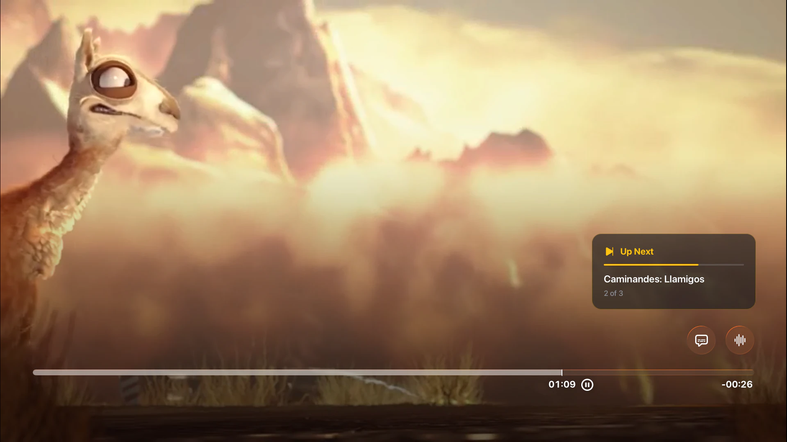
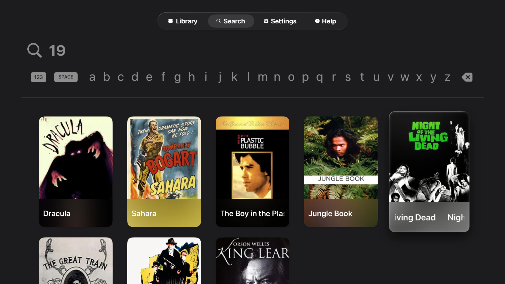
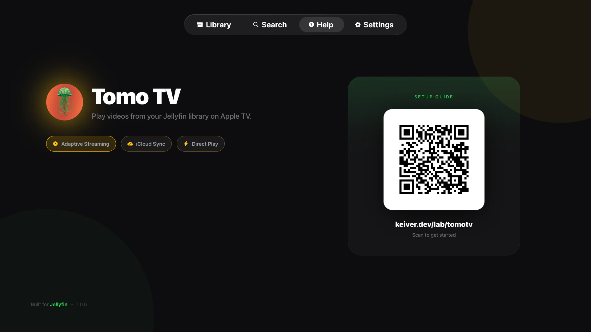
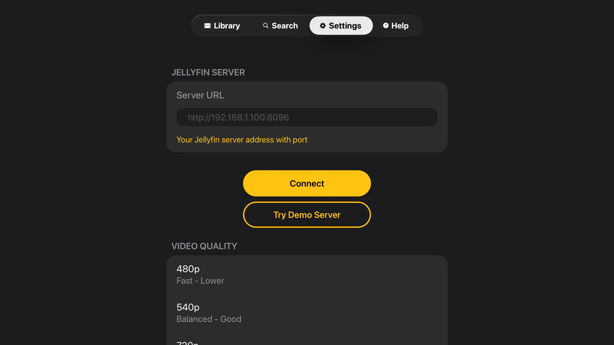
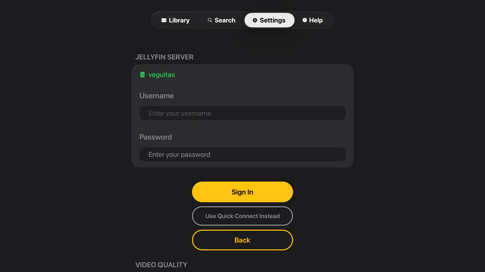

# RadMedia TV - Jellyfin Client for Apple TV

[](https://github.com/keiver/radmedia/releases)
[](LICENSE)
[](https://apps.apple.com/us/app/radmedia-tv/id6755077888)
[](package.json)
[](https://apps.apple.com/us/app/radmedia-tv/id6755077888)

A simple and usable Jellyfin client for Apple TV with seamless multi-audio track switching and advanced subtitle support.

<p align="center">
  
</p>

<table>
  <tr>
    <td align="center">
      <br/>
      <sub>Folder exploration</sub>
    </td>
    <td align="center">
      <br/>
      <sub>Multi-audio track switching</sub>
    </td>
    <td align="center">
      <br/>
      <sub>Subtitle support</sub>
    </td>
  </tr>
  <tr>
    <td align="center">
      <br/>
      <sub>Up next overlay</sub>
    </td>
    <td align="center">
      <br/>
      <sub>Native Search</sub>
    </td>
     <td align="center">
      <br/>
      <sub>Help page</sub>
    </td>
  </tr>
</table>

## Why RadMedia?

Built from the ground up for Apple TV with a focus on seamless playback. Switch audio tracks mid-video without restarting playback, thanks to custom HLS manifest generation. Codec compatibility is handled automatically so you can focus on watching, not troubleshooting.

### Features

- **Multi-Audio Switching** — Change audio tracks mid-playback without restarting. Uses a custom Swift module to generate multivariant HLS manifests.
- **Subtitle Support** — External (.srt) and embedded tracks with native tvOS picker.
- **Smart Codec Handling** — Direct plays H.264/HEVC; auto-transcodes everything else.
- **Native tvOS Search** — SwiftUI-powered with proper focus navigation.
- **Demo Mode** — Try instantly with Jellyfin's demo server.
- **Playlist Support** — Browse and play from your Jellyfin playlists.
- **Secure Storage** — device Keychain (secure local storage).
- **Continue Watching** — Resume videos from last position.

## Installation

### Prerequisites

- **Jellyfin Server 10.8+** with transcoding enabled
- **Node.js 18+** and npm
- **Xcode 15+**
- **Apple TV** or tvOS simulator
- **react-native-tvos** configured project

### Setup

```bash
# Clone the repository
git clone https://github.com/keiver/radmedia.git
cd radmedia

# Install dependencies
npm install

# Configure environment (development only)
cp .env.example .env.local
# Edit .env.local with your Jellyfin server details

# Prebuild for tvOS
npm run prebuild:tv

# Run on tvOS simulator
npm run ios

# Or build for Apple TV device
npx expo run:ios
```

### Jellyfin Server Configuration

- Quick Connect support
- Username/password authentication

<table>
  <tr>
    <td align="center">
      <br/>
      <sub>Quick Connect</sub>
    </td>
    <td align="center">
      <br/>
      <sub>Username/Password</sub>
    </td>
  </tr>
</table>

### Video Quality Presets

RadMedia TV supports 480p, 540p, 720p, 1080p, and 4K transcoding quality presets. Configure via Settings → Video Quality.

### Network Requirements

- **Local network:** HTTP connections allowed via `NSAllowsLocalNetworking`
- **Remote servers:** HTTPS required (security policy)

## Development

```bash
npm start            # Start dev server
npm run ios          # Build and run
npm test             # Run tests
npm run lint         # Lint and auto-fix
npm run prebuild:tv  # Rebuild native projects (deletes ios/ folder)
```

**Native code:** Always edit files in the `native/` folder — the `ios/` folder is regenerated by prebuild and any direct edits will be lost.

## Architecture

Screens live in `app/` using Expo Router's file-based routing with native tvOS tabs. Global state is managed through singleton managers wrapped in React Contexts. Video playback follows a state machine (`IDLE → FETCHING → CREATING_STREAM → READY → PLAYING`) that handles codec detection, automatic transcoding fallback, and multi-audio track switching via a custom Swift HLS manifest generator in `native/ios/`.

### Tech Stack

- **React Native TVOS** — TV-optimized fork of React Native
- **Expo Router 6.0** — File-based routing with native tabs
- **Expo Video 3.0** — Native video playback (AVPlayer)
- **React Native Reanimated 4.1** — GPU-accelerated animations
- **TypeScript 5.9** — Strict type checking
- **Jest 29.7** — Unit and integration tests
- **[expo-tvos-search](https://github.com/keiver/expo-tvos-search)** — Native tvOS search UI using SwiftUI

## A Note on AI

I use Claude as a development tool for drafting code and documentation. Architecture and decisions are mine, blame me for any shady code.

## Contributing

Contributions are welcome! This is a real, production app used by real users.

### Development Workflow

1. Fork the repository
2. Create a feature branch (`git checkout -b feature/cool-feature`)
3. Make your changes following the existing code patterns
4. Add tests for new functionality
5. Run `npm test` to ensure all tests pass
6. Run `npm run lint` to fix any linting issues
7. Commit with clear, descriptive messages
8. Push to your fork and submit a PR

### Code Standards

- **TypeScript:** Strict mode, no `any` types without justification
- **Testing:** Add tests for new features, maintain >50% coverage
- **Error handling:** Try-catch around async operations with structured logging
- **React patterns:** Proper cleanup (useEffect, unsubscribe functions)
- **Comments:** Only where logic isn't self-evident
- **Performance:** No scale animations on grid items; use border-only focus feedback

## Known Limitations

- **Codec support:** Only H.264 and HEVC direct play; all others require transcoding
- **Platform:** tvOS only (Android not supported for now)
- **Network:** HTTP only allowed on local networks; remote servers require HTTPS
- **Server:** Jellyfin only (not compatible with Plex, Emby, etc.)

## License

MIT License - see [LICENSE](LICENSE) file for details.

## Acknowledgments

- **Jellyfin Team** for the excellent open-source media server
- **Expo Team** for React Native TVOS support
- **Blender Foundation** for open movie test files (Sintel, Elephants Dream...)
- **IETF** for Matroska test files used in development

## Links

- **Documentation:** [keiver.dev/lab/radmedia](https://keiver.dev/lab/radmedia)
- **Support:** <contact@keiver.dev>
- **Demo Server:** Uses Jellyfin's official demo at demo.jellyfin.org
- **expo-tvos-search:** [github.com/keiver/expo-tvos-search](https://github.com/keiver/expo-tvos-search)

---

Built with ❤️ for the Jellyfin community.
