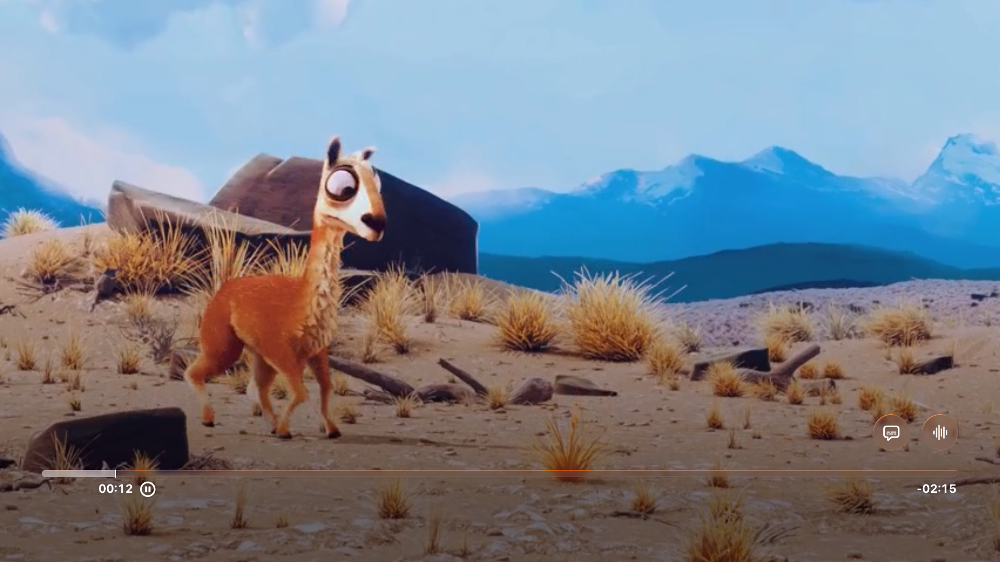
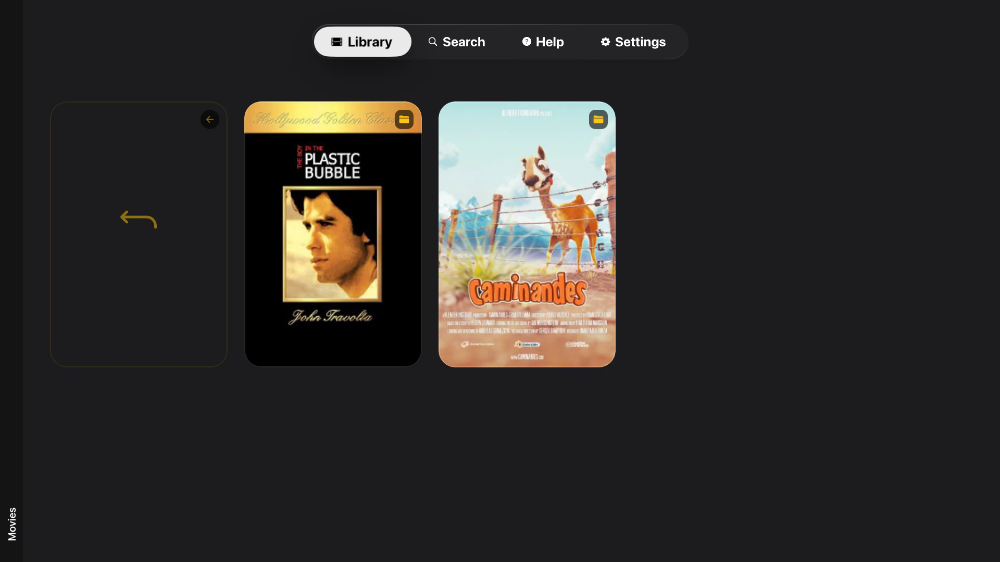
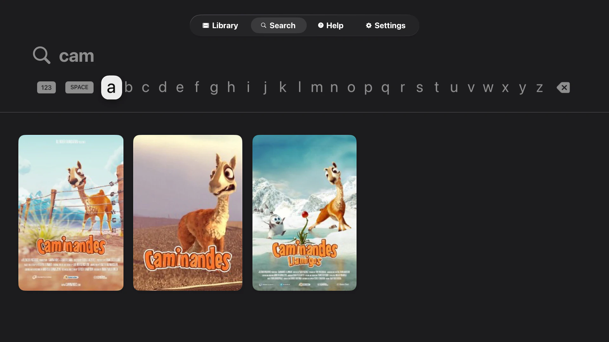

# TomoTV

[](https://github.com/keiver/tomotv/releases)
[](LICENSE)
[](https://developer.apple.com/tvos/)
[](package.json)

A production-ready Jellyfin client for Apple TV with seamless multi-audio track switching and advanced subtitle support.

<p align="center">
  
</p>

<table>
  <tr>
    <td align="center">
      <br/>
      <sub>Library view</sub>
    </td>
    <td align="center">
      <br/>
      <sub>Folder exploration</sub>
    </td>
     <td align="center">
      <br/>
      <sub>Native tvOS search</sub>
    </td>
      <td align="center">
      <br/>
      <sub>Help screen</sub>
    </td>
  </tr>
</table>

## Why TomoTV?

Built from the ground up for Apple TV with a focus on seamless playback. Switch audio tracks mid-video without restarting playback, thanks to custom HLS manifest generation. Codec compatibility is handled automatically so you can focus on watching, not troubleshooting.

### Features

- **Multi-Audio Switching** — Change audio tracks mid-playback without restarting. Uses a custom Swift module to generate multivariant HLS manifests.
- **Subtitle Support** — External (.srt) and embedded tracks with native tvOS picker.
- **Smart Codec Handling** — Direct plays H.264/HEVC; auto-transcodes everything else.
- **Native tvOS Search** — SwiftUI-powered with proper focus navigation.
- **Demo Mode** — Try instantly with Jellyfin's demo server.
- **Playlist Support** — Browse and play from your Jellyfin playlists.
- **Secure Storage** — iCloud Keychain with cross-device sync.

## Installation

### Prerequisites

- **Jellyfin Server 10.8+** with transcoding enabled
- **Node.js 18+** and npm
- **Xcode 15+** (macOS only)
- **Apple TV 4K** or tvOS simulator
- **react-native-tvos** configured project

### Setup

```bash
# Clone the repository
git clone https://github.com/keiver/tomotv.git
cd tomotv

# Install dependencies
npm install

# Configure environment (development only)
cp .env.example .env.local
# Edit .env.local with your Jellyfin server details

# Prebuild for tvOS
npm run prebuild:tv

# Run on tvOS simulator
npm run ios

# Or build for Apple TV device
npx expo run:ios
```

### Jellyfin Server Configuration

1. Enable transcoding in **Jellyfin Dashboard → Playback → Transcoding**
2. Install FFmpeg if not already available
3. Create API key in **Dashboard → API Keys**
4. Get User ID from **Dashboard → Users** (click username, copy ID from URL)
5. Enter credentials in TomoTV Settings or use demo mode

## Configuration

### Environment Variables (Development)

```bash
# .env.local (not tracked in git)
EXPO_PUBLIC_DEV_JELLYFIN_SERVER=http://192.168.1.100:8096
EXPO_PUBLIC_DEV_JELLYFIN_API_KEY=your_api_key_here
EXPO_PUBLIC_DEV_JELLYFIN_USER_ID=your_user_id_here
```

**Production builds** do not use environment variables. Users configure credentials via the Settings screen, which stores them securely in iCloud Keychain.

### Video Quality Presets

TomoTV supports 480p, 540p, 720p, and 1080p transcoding quality presets. Configure via Settings → Video Quality.

### Network Requirements

- **Local network:** HTTP connections allowed via `NSAllowsLocalNetworking`
- **Remote servers:** HTTPS required (security policy)
- **Bonjour discovery:** Enabled for automatic Jellyfin server detection

## Development

```bash
npm start            # Start dev server
npm run ios          # Build and run
npm test             # Run tests (306 passing)
npm run prebuild:tv  # Prebuild with tvOS support
```

**Native code:** Edit files in `native/` folder, not `ios/`. The `ios/` folder is regenerated by prebuild.

See [`memories/CLAUDE-development.md`](memories/CLAUDE-development.md) for full setup guide.

## Architecture

- **React Native TVOS** (npm:react-native-tvos@0.81.4-0)
- **Expo Router 6.0** with file-based routing
- **Expo Video 3.0** for native video playback
- **React Native Reanimated 4.1** for GPU-accelerated animations
- **TypeScript 5.9** with strict type checking
- **Jest 29.7** with 306 passing tests
- **expo-tvos-search 1.3.1** for native tvOS search UI

### External Dependencies

This project includes [`expo-tvos-search`](https://github.com/keiver/expo-tvos-search) — a native tvOS search module using SwiftUI's `.searchable` modifier. It solves the focus navigation issues that exist with React Native's TextInput + FlatList on tvOS.

See [`memories/CLAUDE-external-dependencies.md`](memories/CLAUDE-external-dependencies.md) for full dependency documentation.

## Documentation

TomoTV includes comprehensive documentation in the `memories/` folder:

### Implementation
- [`CLAUDE-api-reference.md`](memories/CLAUDE-api-reference.md) - Complete Jellyfin API function reference
- [`CLAUDE-state-management.md`](memories/CLAUDE-state-management.md) - State management architecture
- [`CLAUDE-multi-audio.md`](memories/CLAUDE-multi-audio.md) - Multi-audio track switching implementation
- [`CLAUDE-patterns.md`](memories/CLAUDE-patterns.md) - Common development patterns

### Testing & Quality
- [`CLAUDE-testing.md`](memories/CLAUDE-testing.md) - Test strategy and manual test videos
- [`CLAUDE-security.md`](memories/CLAUDE-security.md) - Security architecture and audit
- [`CLAUDE-app-performance.md`](memories/CLAUDE-app-performance.md) - Performance optimizations

### Deployment
- [`CLAUDE-apple-store-metadata.md`](memories/CLAUDE-apple-store-metadata.md) - App Store copy and metadata
- [`CLAUDE-apple-store-checklist.md`](memories/CLAUDE-apple-store-checklist.md) - Submission checklist
- [`CLAUDE-development.md`](memories/CLAUDE-development.md) - Development setup guide

### Main Documentation
- [`CLAUDE.md`](CLAUDE.md) - Complete project overview and workflow rules

## Contributing

Contributions are welcome! This is a real, production app used by real users.

### Development Workflow

1. Fork the repository
2. Create a feature branch (`git checkout -b feature/amazing-feature`)
3. Make your changes following the existing patterns in [`memories/CLAUDE-patterns.md`](memories/CLAUDE-patterns.md)
4. Add tests for new functionality
5. Run `npm test` to ensure all tests pass
6. Run `npm run lint` to fix any linting issues
7. Commit with clear, descriptive messages
8. Push to your fork and submit a PR

### Code Standards

- **TypeScript:** Strict mode, no `any` types without justification
- **Testing:** Add tests for new features, maintain >50% coverage
- **Error handling:** Try-catch around async operations with structured logging
- **React patterns:** Proper cleanup (useEffect, unsubscribe functions)
- **Comments:** Only where logic isn't self-evident
- **Performance:** Follow patterns in [`memories/CLAUDE-app-performance.md`](memories/CLAUDE-app-performance.md)

## Known Limitations

- **Codec support:** Only H.264 and HEVC direct play; all others require transcoding
- **Platform:** iOS/tvOS only (Android not supported)
- **Network:** HTTP only allowed on local networks; remote servers require HTTPS
- **Server:** Jellyfin only (not compatible with Plex, Emby, etc.)

## License

MIT License - see [LICENSE](LICENSE) file for details.

## Acknowledgments

- **Jellyfin Team** for the excellent open-source media server
- **Expo Team** for React Native TVOS support
- **Blender Foundation** for open movie test files (Sintel, Elephants Dream)
- **IETF** for Matroska test files used in development

## Links

- **Documentation:** [keiver.dev/lab/tomotv](https://keiver.dev/lab/tomotv)
- **Support:** contact@keiver.dev
- **Demo Server:** Uses Jellyfin's official demo at demo.jellyfin.org
- **expo-tvos-search:** [github.com/keiver/expo-tvos-search](https://github.com/keiver/expo-tvos-search)

---

Built with ❤️ for the Jellyfin community.
